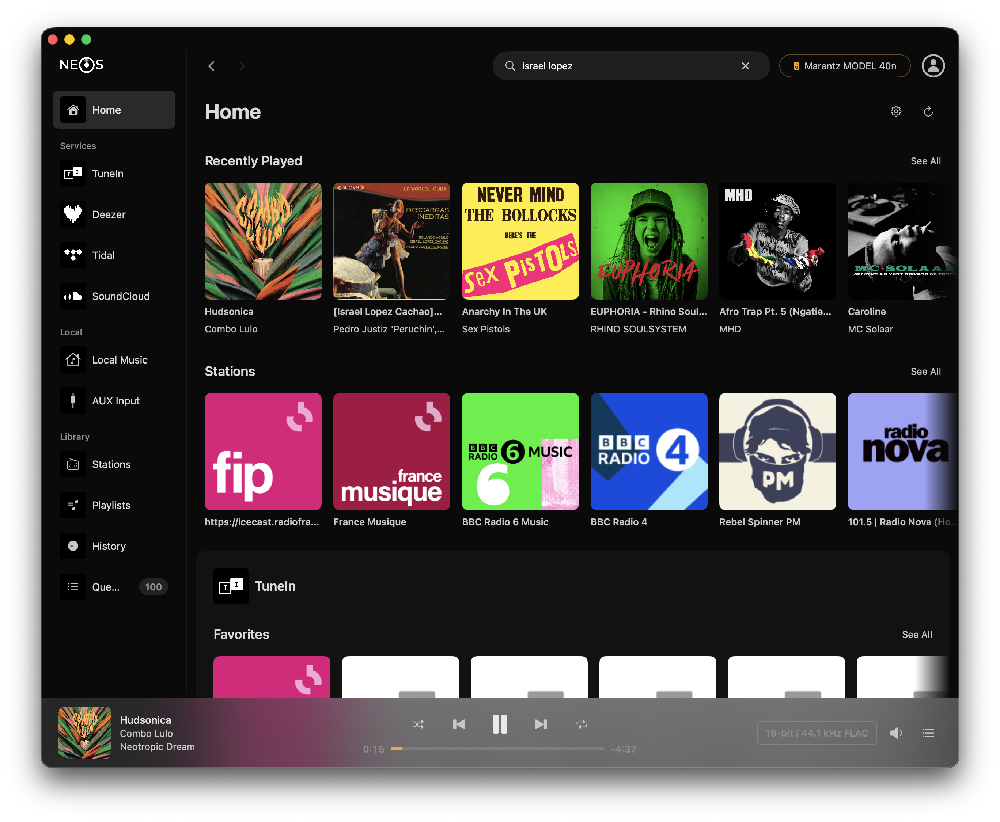
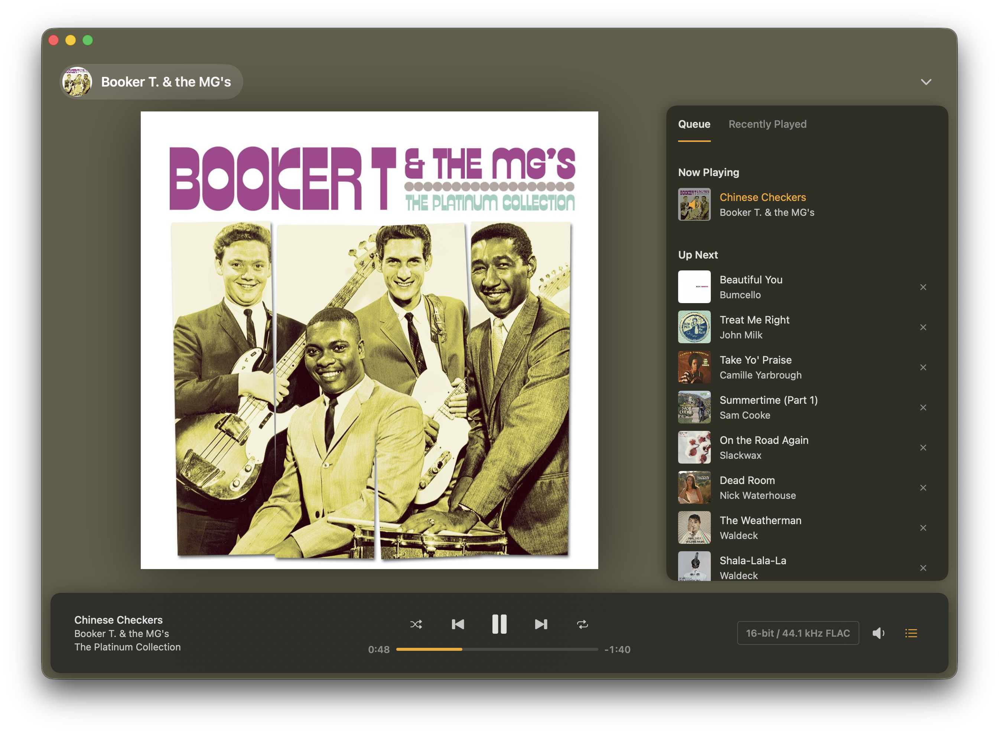
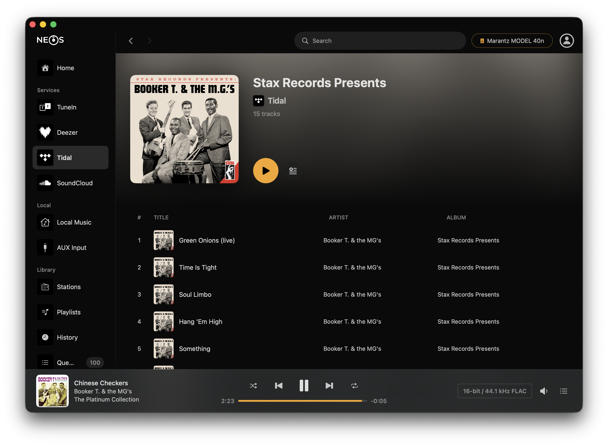
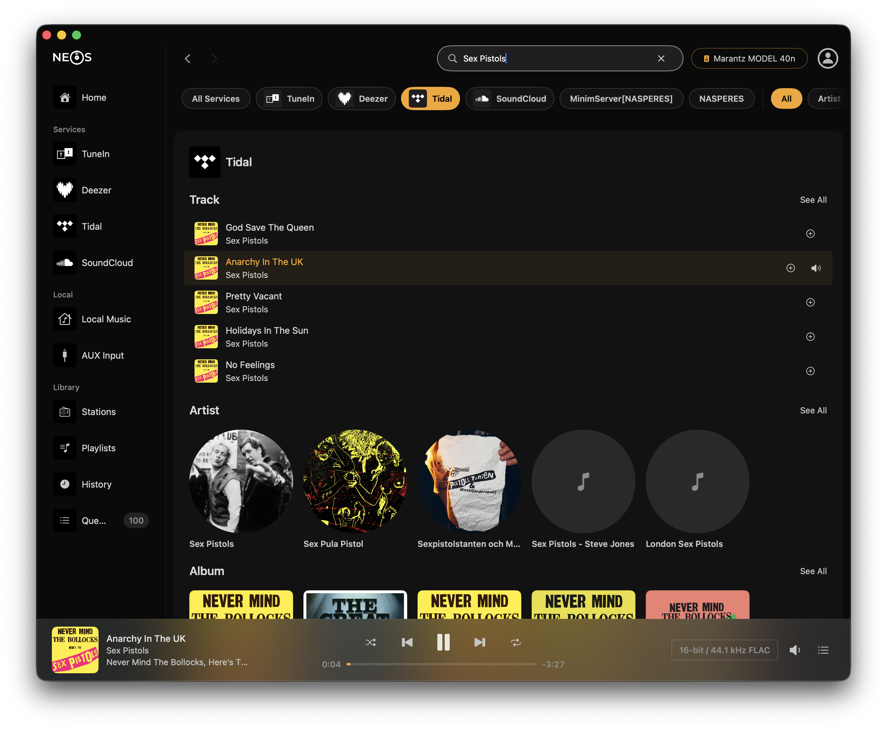

# Neos

A native macOS app for controlling Denon and Marantz HEOS speakers. Built with SwiftUI. No third-party dependencies.

## Why?

I spend most of my day at my computer, and I got tired of reaching for my phone every time I wanted to skip a track or browse my Tidal library on my Marantz speaker. There's no official HEOS app for Mac, so I built one.

Using the Tidal desktop app with HEOS isn't great either — it only supports Tidal Connect, which means no queue management, no browse integration, and you can't mix in radio stations or local music. With Neos I can jump from a Tidal album to a TuneIn radio station to a SoundCloud mix to a FLAC from my NAS, all from the same place.

- **Lives in your menu bar** — always one click away, never in the way.
- **Fast** — connects to your last speaker in under 500ms. No splash screen, no loading spinner.
- **All your music in one place** — switch between Tidal, SoundCloud, TuneIn, Deezer, and local music without changing apps.
- **Audio quality info** — shows what's actually playing: bit depth, sample rate, and codec (e.g. "16-bit / 44.1 kHz FLAC").
- **Native macOS** — SwiftUI, no Electron, no web wrapper.

## Features

- Play, pause, skip, previous with seekable progress bar
- Shuffle and repeat modes
- Volume slider with mute, dB readout, and hardware volume limit
- Home screen with recently played, favorites, and quick access to your services
- Browse music sources with infinite scroll
- Search across services with category filters (tracks, artists, albums)
- Full-screen Now Playing view with album art and queue panel
- Click an artist or album name to jump to their page
- Automatic speaker discovery on your local network
- Power on/off your receiver
- HEOS account sign-in for favorites across devices
- Menu bar compact player with playback controls and volume

## Tested With

Neos has been primarily tested with **Tidal**, **SoundCloud**, **TuneIn**, and **local music** (USB / NAS). Deezer works but has had less testing. Other HEOS-supported services (Spotify, Amazon Music, Pandora, Napster, etc.) should work through the standard HEOS protocol but haven't been tested yet — feedback welcome.

Speaker grouping (multi-room) is implemented but hasn't been tested with multiple speakers.

## Download

**Requires** macOS 14.0 (Sonoma) or later and a Denon or Marantz speaker with HEOS built-in, on the same network.

1. Download the latest DMG from [Releases](https://github.com/gaelsimon/neos-audio/releases/latest)
2. Open the DMG and drag Neos to your Applications folder
3. Launch Neos — it appears in your menu bar
4. Your speaker should be discovered automatically

## How It Works

Neos talks directly to your speaker over the local network. No cloud, no internet required for playback.

| Protocol | Port | Purpose |
|----------|------|---------|
| HEOS CLI | TCP 1255 | Commands, events, browsing |
| UPnP AVTransport | HTTP 60006 | Seek, position, track metadata |
| UPnP ACT Denon | HTTP 60006 | Hardware volume limit |
| AVR Telnet | TCP 23 | Power on/off |
| SSDP | UDP 1900 | Speaker discovery |

## Built With

Swift and SwiftUI. Only Apple frameworks (Network.framework, Foundation, Security). No Combine — async/await throughout.

## Known Limitations

- Speaker grouping is untested (I only have one speaker)
- Some music services beyond Tidal/SoundCloud/TuneIn/Deezer are untested
- Not notarized yet — you may need to right-click > Open on first launch

### About the HEOS protocol

Neos uses the public [HEOS CLI protocol](https://rn.dmglobal.com/usmodel/HEOS_CLI_ProtocolSpecification-Version-1.17.pdf), which is what Denon documents for third-party integrations. It works well for playback, browsing, and queue management, but it has limits — some features available in the official HEOS iOS app (like "Go to Artist" on a non-playing queue track, or adding to a Tidal playlist) use a separate proprietary protocol that isn't publicly documented. Neos works around some of these gaps (e.g. searching for the artist instead), but a few things just aren't possible through the public API.

## Support

If you find Neos useful, consider supporting its development:

[Buy me a coffee on Ko-fi](https://ko-fi.com/galela)

## License

Copyright 2025-2026 Gael Simon. All rights reserved.
